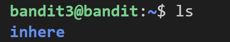
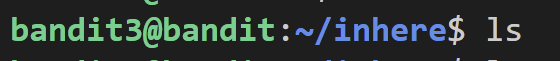
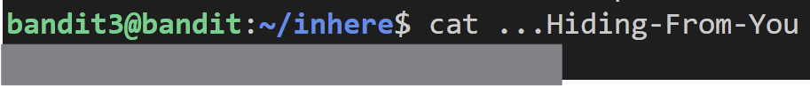

# Bandit
- [Challange Information](#challenge-information)
- [Level 0](#level-0)
- [Level 1](#level-1)
- [Level 2](#level-2)
- [Level 3](#level-3)
- [Level 4](#level-4)

## Challenge Information

The Bandit wargame is aimed at absolute beginners. It will teach the basics needed to be able to play other wargames.

This game, like most other games, is organised in level. You start at Level 0 and to to "beat" or "finish" it. Finishing a level results in information on how to start the next level.

The game is accessed using SSH. The host to connect to is bandit.labs.overthewire.org on port 2220 (`bandit<level>@bandit.labs.overthewire.org -p 2220`). The username and password can be found on the [Level 0](https://overthewire.org/wargames/bandit/bandit0.html) page of the OverTheWire website.

## Level 0
### Level Goal
The password for the next level is stored in a file called **readme** located in the home directory. Use this password to log into bandit1 using SSH. Whenever you find a password for a level, use SSH (on port 2220) to log into that level and continue the game.

### Solution
**1. List files.**

`ls`

This lists the files and directories in the current directory. I used it to confirm if the `readme` file is present or to determine if I need to navigate to another directory.

**2. Check file type**

`file readme`

This checks the file type of `readme`. Different file types require different methods to access their content, so this step ensures we know how to proceed.

**3. Display content**

`cat readme`

Since the `readme` file was identified as an ASCII text file, I used `cat` to display its content and retrieve the password for the next level.

>[!NOTE]
>This is **NOT** the most efficient way to go about this problem. Though it is reasonable to determine the file type, in most cases, you can directly attept to read the file with `cat`. The `file` command is only necessary if `cat` or another reading method fails.

## Level 1
### Level Goal
The password for the next level is stored in a file called **-** located in the home directory.

### Solution
**1. List files.**

`ls`
Verifies the presence of the file named `-` in the current directory.

**2. Display Contents.**

`cat ./-`

Using `cat` directly with `-` would cause issues since `-` is interpreted as standard input. Preceding the filename with `./` explicitly references the file and avoids this issue. Additionally, using `./` is a good practice for handling file names with special characters.

## Level 2
### Level Goal
The password for the next level is stored in a file called **spaces in this filename** located in the home directory.

### Solution
**1. List files.**

`ls`

Verifies the presence of the file named `spaces in this filename` in the current directory.

**2. Display contents.**

`cat "spaces in this filename"`

Since the file name contains spaces, wrapping it in quotes tells the command to treat the entire name as one file instead of breaking it up.

## Level 3
### Level Goal
The password for the next level is stored in a hidden file in the `inhere` directory.

### Solution
**1. List directory**

`ls`

Verifies that the inhere directory exists in the current working directory.

**2. Verify `inhere` is a Directory *Optional***
`file inhere`

Confirms that `inhere` is a directory. This step is optional if you already know the target is a directory.

**3. List files in `inhere` directory**
`ls`

Lists visible files in the `inhere` directory. Since the target is a hidden file, this step likely won't reveal it but provides an initial overview.

**4. List hidden files in inhere directory**
`ls -al`

Lists all files, including hidden ones (files beginning with a `.`), in the `inhere` directory. This reveals the target file.

**5. Display contents**
`cat ...Hiding-From-You`

Reads the content of the hidden file to retrieve the password.

## Level 4
### Level Goal
The password for the next level is stored in the only human-readable file in the `inhere` directory.

### Solution
**1. List Directory**
`ls`

Verifies that the `inhere` directory exists in the current working directory.

**2. Check Filetypes of the Files in the `inhere` Directory**
`file inhere/*`

Lists all files in the `inhere` directory along with their file types. This helps identify the human-readable file, which will be labeled as **ASCII text**.

**Alternative:**
`file inhere/* | grep ASCII text` 

Filters the output to display only files classified as ASCII text, making it easier to locate the target file.

**3. Display Contents**
`cat inhere/-file07`

Reads the content of the file to retrieve the password.