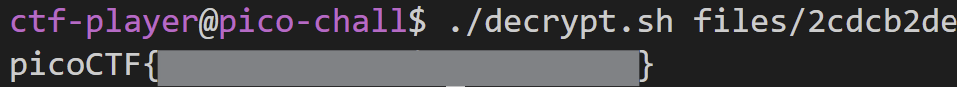

# Verify

- [Challange Information](#challenge-information)
- [Solution](#solution)
- [Solution Breakdown](#breakdown)

## Challenge Information
```
Author: Jeffery John

Description:
People keep trying to trick my players with imitation flags. I want to make sure they get the real thing! I'm going to provide the SHA-256 hash and decrypt script to help you know that my flags are legitimate.

`ssh -p 53891 ctf-player@rhea.picoctf.net`

Using the password `1db87a14`. Accept the fingerprint with yes, and `ls` once connected to begin. Remember, in a shell, passwords are hidden!
- Checksum: 55b983afdd9d10718f1db3983459efc5cc3f5a66841e2651041e25dec3efd46a
- To decrypt the file once you've verified the hash, run `./decrypt.sh files/<file>`.

Hints:
1. Checksums let you tell if a file is complete and from the original distributor. If the hash doesn't match, it's a different file/
2. You can create a SHA checksum of a file with `sha256sum <file>` or all files in a directory with `sha256sum <directory>/*`.
3. Remember you can pipe the output of one command to another with `|`.
```
[Challenge link](https://play.picoctf.org/practice/challenge/450)
## Solution
### 1. Open Terminal
Launch any terminal. For this solution, I used Ubuntu.
### 2. Connect via SSH.
Connect using the provided SSH command. Accept the fingerprint by typing `yes` and enter the given password.
### 3. List Files
Check the files in the directory:
```
ls -l
```

View contents of the files subdirectory:
```
ls -l files/*
```

### 4. Verify SHA-256 Checksum
Match the file's SHA-256 checksum with the one in `checksum.txt`:
```
sha256sum files/* | grep -f checksum.txt
```

This identifies the file `files/2cdcb2de`
### 5. Read the File
Check the file's contents:
```
cat files/2cdcb2de
```

Output indicates the file is encrypted.
### 6.  Decrypt the File
Run the decryption script on the identified file:
```
./decrypt.sh files/2cdcb2de
```
Decrypt output:

## Breakdown
### 1. `ls -l`
This command is used to confirm that the key files (`checksum.txt` and `decrypt.sh`) are present in the current directory. These files are essential to solve the challenge, so this step ensures they exist and verifies their properties (whether they are executable).
### 2. `ls -l files/*`
This command lists all the files in the `files` directory, giving us an overview of how many files we are dealing with.
### 3. `sha256sum files/* | grep -f checksum.txt`
To identify the file that matches the checksum provided in `checksum.txt`.
- `sha256sum files/*`: Computes the SHA-256 hashes of all files in the `files` directory.
- `grep -f checksum.txt`: Filters the output to match the computed hash with the reference in `checksum.txt`.
This step identifies the target file (`files/2cdcb2de`) that needs to be decrypted.
### 4. `cat files/2cdcb2de`
To examine the content of the identified file and confirm it's encrypted. The presence of the `Salted__` prefix indicates encryption, hinting at the need for decryption.
### 5. `./decrypt.sh files/2cdcb2de`
To decrypt the target file using the provided decryption script, which gives us the flag.